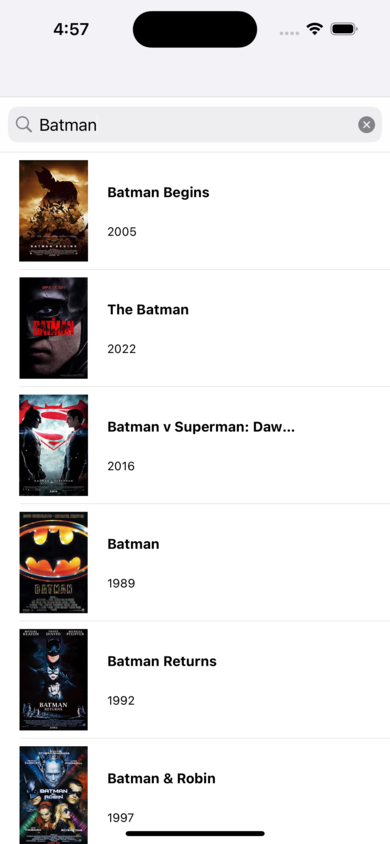
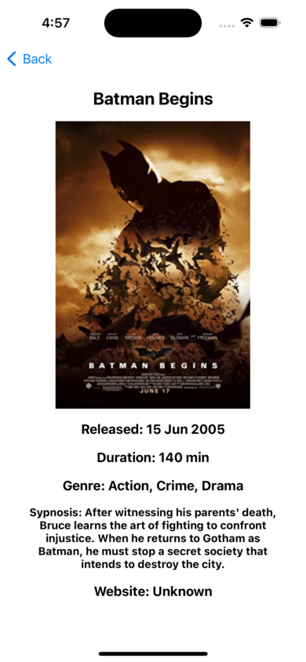

# MovieDB App

La **MovieDB App** es una aplicación que te permite buscar información sobre películas utilizando la base de datos de IMDb. Puedes buscar películas por título y ver detalles como el título, año de lanzamiento, duración, género, sinopsis y más.

## Capturas de pantalla

## Características

- Búsqueda de películas por título.
- Visualización de detalles de películas, incluyendo título, año de lanzamiento, duración, género, sinopsis y más.
- Interfaz de usuario intuitiva y fácil de usar.
- Integración con la base de datos de IMDb a través de su API.

## Tecnologías utilizadas

- Swift
- UIKit
- URLSession para hacer solicitudes HTTP a la API de IMDb.
- JSONDecoder para analizar las respuestas de la API.
- Xcode como entorno de desarrollo.

## Instalación

1. Clona este repositorio en tu máquina local.
2. Abre el proyecto en Xcode.
3. Compila y ejecuta la aplicación en el simulador o en un dispositivo real.

## Contribución

Las contribuciones son bienvenidas. Si deseas contribuir a este proyecto, sigue estos pasos:

1. Haz un fork del repositorio.
2. Crea una nueva rama (`git checkout -b feature/nueva-funcionalidad`).
3. Realiza tus cambios y haz commits (`git commit -am 'Añadir nueva funcionalidad'`).
4. Haz push a la rama (`git push origin feature/nueva-funcionalidad`).
5. Abre una solicitud de extracción.

## Autor

Alejandro Rodríguez Cañete - [@usuario](https://github.com/usuario)

## Licencia

Este proyecto está bajo la Licencia MIT. Consulta el archivo [LICENSE](LICENSE) para obtener más detalles.
